# SƠ ĐỒ THỰC THỂ QUAN HỆ (ERD) - HỆ THỐNG MINI-ERP

## 1. Sơ đồ Thực thể Quan hệ (Mermaid)

```mermaid
erDiagram
    USERS ||--o{ USER_ROLES : "gán vai trò"
    ROLES ||--o{ USER_ROLES : "chứa người dùng"
    ROLES ||--o{ ROLE_PERMISSIONS : "có quyền"
    PERMISSIONS ||--o{ ROLE_PERMISSIONS : "được cấp"

    CATEGORIES ||--o{ CATEGORIES : "cha - con (parent_id)"
    CATEGORIES ||--o{ PRODUCTS : "phân loại"
    PRODUCTS ||--o{ PRODUCT_ATTRIBUTES : "thuộc tính (màu, size...)"
    
    CUSTOMER_GROUPS ||--o{ CUSTOMERS : "nhóm khách hàng"
    CUSTOMER_GROUPS ||--o{ PRICE_LISTS : "áp dụng bảng giá"
    PRICE_LISTS ||--o{ PRICE_LIST_ITEMS : "chi tiết giá theo SP"
    PRODUCTS ||--o{ PRICE_LIST_ITEMS : "định giá trong bảng giá"

    CUSTOMERS ||--o{ SALES_ORDERS : "đặt hàng"
    WAREHOUSES ||--o{ SALES_ORDERS : "kho xuất dự kiến"
    SALES_ORDERS ||--o{ SALES_ORDER_ITEMS : "chi tiết dòng đơn hàng"
    PRODUCTS ||--o{ SALES_ORDER_ITEMS : "sản phẩm bán"
    SALES_ORDERS ||--o{ SALES_ORDER_STATUS_HISTORY : "nhật ký chuyển trạng thái"
    SALES_ORDERS ||--o{ GOODS_ISSUE_NOTES : "sinh phiếu xuất kho"

    SUPPLIERS ||--o{ SUPPLIER_REVIEWS : "đánh giá chấm điểm"
    SUPPLIERS ||--o{ PURCHASE_ORDERS : "cung cấp theo đơn PO"
    WAREHOUSES ||--o{ PURCHASE_ORDERS : "kho nhập hàng"
    PURCHASE_ORDERS ||--o{ PURCHASE_ORDER_ITEMS : "chi tiết dòng đặt mua"
    PRODUCTS ||--o{ PURCHASE_ORDER_ITEMS : "sản phẩm đặt mua"
    PURCHASE_ORDERS ||--o{ GOODS_RECEIPT_NOTES : "sinh phiếu nhập kho"
    PURCHASE_ORDERS ||--o{ SUPPLIER_DEBTS : "phát sinh công nợ phải trả"
    SUPPLIERS ||--o{ SUPPLIER_DEBTS : "theo dõi nợ"
    SUPPLIER_DEBTS ||--o{ SUPPLIER_PAYMENTS : "lịch sử phiếu chi trả nợ"
    SUPPLIERS ||--o{ SUPPLIER_PAYMENTS : "nhận thanh toán"

    WAREHOUSES ||--o{ INVENTORY : "chứa tồn kho"
    PRODUCTS ||--o{ INVENTORY : "tồn theo kho"
    WAREHOUSES ||--o{ STOCK_LEDGER : "sổ cái biến động kho"
    PRODUCTS ||--o{ STOCK_LEDGER : "hàng hóa biến động"
    
    WAREHOUSES ||--o{ GOODS_RECEIPT_NOTES : "nhận hàng tại kho"
    GOODS_RECEIPT_NOTES ||--o{ GOODS_RECEIPT_ITEMS : "chi tiết hàng thực nhận"
    PRODUCTS ||--o{ GOODS_RECEIPT_ITEMS : "sản phẩm nhập"

    WAREHOUSES ||--o{ GOODS_ISSUE_NOTES : "xuất hàng từ kho"
    GOODS_ISSUE_NOTES ||--o{ GOODS_ISSUE_ITEMS : "chi tiết hàng xuất"
    PRODUCTS ||--o{ GOODS_ISSUE_ITEMS : "sản phẩm xuất"
```

## 2. Danh mục 28 Bảng & Mục đích Sử dụng

| STT | Tên Bảng | Phân hệ | Mục đích |
|---|---|---|---|
| 1 | `users` | Auth/RBAC | Quản lý tài khoản người dùng, mã hóa mật khẩu BCrypt |
| 2 | `roles` | Auth/RBAC | Danh sách vai trò (ADMIN, SALES, PURCHASING, WAREHOUSE, ACCOUNTANT) |
| 3 | `permissions` | Auth/RBAC | Quyền chi tiết theo module/hành động |
| 4 | `user_roles` | Auth/RBAC | Liên kết N-N giữa người dùng và vai trò |
| 5 | `role_permissions` | Auth/RBAC | Liên kết N-N giữa vai trò và quyền |
| 6 | `categories` | Sản phẩm | Cây phân cấp danh mục hàng hóa (tự tham chiếu parent_id) |
| 7 | `products` | Sản phẩm | Thông tin mặt hàng, SKU, Barcode, đơn vị tính, giá vốn, giá niêm yết |
| 8 | `product_attributes` | Sản phẩm | Thuộc tính thời trang (Màu sắc, Kích cỡ Size, Chất liệu, Form dáng...) |
| 9 | `customer_groups` | Khách hàng | Nhóm khách (Lẻ, Thân thiết, VIP, Đại lý) kèm chiết khấu mặc định |
| 10 | `customers` | Khách hàng | Thông tin khách hàng cá nhân / doanh nghiệp, MST, địa chỉ |
| 11 | `price_lists` | Bán hàng | Chính sách giá theo thời gian hiệu lực và nhóm đối tượng khách hàng |
| 12 | `price_list_items` | Bán hàng | Chi tiết đơn giá riêng cho từng sản phẩm theo bảng giá |
| 13 | `sales_orders` | Bán hàng | Đơn bán hàng (order_code, tổng tiền, thuế, chiết khấu, trạng thái) |
| 14 | `sales_order_items` | Bán hàng | Dòng chi tiết đơn bán (sản phẩm, số lượng, đơn giá, thành tiền) |
| 15 | `sales_order_status_history` | Bán hàng | Audit log ghi nhận lịch sử chuyển trạng thái đơn (ai đổi, lý do, lúc nào) |
| 16 | `suppliers` | Mua hàng | Thông tin nhà cung cấp, mã số thuế, nhóm hàng, điểm và hạng (A/B/C) |
| 17 | `supplier_reviews` | Mua hàng | Đánh giá chất lượng, thời gian giao hàng, giá cả (thang điểm 1-10) |
| 18 | `purchase_orders` | Mua hàng | Đơn đặt mua hàng NCC, quy trình duyệt hạn mức |
| 19 | `purchase_order_items` | Mua hàng | Chi tiết sản phẩm, số lượng đặt mua, đơn giá dự kiến |
| 20 | `supplier_debts` | Mua hàng / Kế toán | Công nợ phải trả tự động phát sinh khi nhập kho hàng mua |
| 21 | `supplier_payments` | Mua hàng / Kế toán | Phiếu chi/thanh toán tiền mặt hoặc ngân hàng cho công nợ NCC |
| 22 | `warehouses` | Kho | Quản lý nhiều kho hàng, chi nhánh, thủ kho phụ trách |
| 23 | `inventory` | Kho | Tồn kho thực tế (quantity_on_hand), đã giữ chỗ (reserved), khả dụng (available) |
| 24 | `stock_ledger` | Kho | Sổ cái kho (Stock Ledger) ghi nhận từng giao dịch nhập/xuất/điều chỉnh |
| 25 | `goods_receipt_notes` | Kho | Phiếu nhập kho (từ PO hoặc nhập nội bộ) |
| 26 | `goods_receipt_items` | Kho | Dòng chi tiết hàng thực nhận đối chiếu với số lượng đặt |
| 27 | `goods_issue_notes` | Kho | Phiếu xuất kho (tự động sinh khi duyệt SO hoặc xuất khác) |
| 28 | `goods_issue_items` | Kho | Dòng chi tiết hàng thực xuất khỏi kho |

## 3. Kiến trúc Tối giản: Zero-FK & Zero-Join Flat Read Model

Nhằm đáp ứng yêu cầu **"giảm tải liên kết bảng và cấu trúc bảng hết mức"**, kiến trúc cơ sở dữ liệu đã được tinh gọn triệt để:

### 3.1. Zero Database-Level Foreign Keys (Không ràng buộc FK cứng)
- Toàn bộ 28 bảng **không có bất kỳ khóa ngoại vật lý nào (`CONSTRAINT fk_...`)** ở tầng MySQL Engine.
- Toàn vẹn tham chiếu và tính hợp lệ logic nghiệp vụ được ủy quyền 100% cho tầng ứng dụng Spring Data JPA xử lý.
- **Lợi ích**:
  - Loại bỏ hoàn toàn Foreign Key Lock Contention khi nhiều luồng thực hiện Insert/Update/Delete đồng thời.
  - Tăng tốc độ ghi (throughput) vượt trội khi import/export dữ liệu lớn.
  - Phù hợp với kiến trúc mở rộng phân tán, Sharding hoặc tách Microservices trong tương lai.

### 3.2. Zero-Join Flat Read Model (Denormalization - Đọc dữ liệu phẳng không cần JOIN)
- Các trường hiển thị thường dùng được nhúng trực tiếp (*denormalized*) vào các bảng giao dịch và kho vận:
  - `sales_orders`: Mang trực tiếp `customer_code`, `customer_name`, `customer_phone`, `warehouse_code`, `warehouse_name`.
  - `sales_order_items`: Mang trực tiếp `product_sku`, `product_name`, `product_unit`.
  - `purchase_orders`: Mang trực tiếp `supplier_code`, `supplier_name`, `warehouse_code`, `warehouse_name`.
  - `purchase_order_items`: Mang trực tiếp `product_sku`, `product_name`, `product_unit`.
  - `inventory` & `stock_ledger`: Mang trực tiếp `warehouse_code`, `warehouse_name`, `product_sku`, `product_name`.
  - `goods_receipt_notes` & `goods_issue_notes`: Mang trực tiếp `supplier_name`, `customer_name`, `warehouse_name`.
  - `goods_receipt_items` & `goods_issue_items`: Mang trực tiếp `product_sku`, `product_name`, `product_unit`.
  - `supplier_debts` & `supplier_payments`: Mang trực tiếp `po_code`, `supplier_name`, `debt_invoice_code`.
- **Lợi ích**:
  - Cho phép các câu lệnh `SELECT` truy vấn màn hình danh sách, báo cáo hoặc tìm kiếm chỉ từ **1 bảng duy nhất (Single-Table Query)** mà không cần qua 3–4 bảng `JOIN`.
  - Triệt tiêu lỗi N+1 Hibernate Lazy Loading khi duyệt danh sách đối tượng.

### 3.3. Tối giản Chỉ mục (Index Pruning)
- Loại bỏ toàn bộ Secondary Non-Unique Indexes dư thừa trên các cột trạng thái hoặc khóa ngoại.
- Chỉ giữ lại duy nhất **Primary Keys (`id`)** và **Business Unique Constraints** (`sku`, `order_code`, `po_code`, `grn_code`, `gin_code`, `invoice_code`, `payment_code`, `uk_inv_wh_prod`).
- **Lợi ích**: Giảm thiểu diện tích lưu trữ B-Tree trong InnoDB Buffer Pool, giảm chi phí Disk I/O khi ghi dữ liệu.

