# SƠ ĐỒ THỰC THỂ QUAN HỆ (ERD) - HỆ THỐNG MINI-ERP

## 1. Sơ đồ Thực thể Quan hệ (Mermaid)

```mermaid
erDiagram
    USERS ||--o{ USER_ROLES : "gán vai trò"
    ROLES ||--o{ USER_ROLES : "chứa người dùng"
    ROLES ||--o{ ROLE_PERMISSIONS : "có quyền"
    PERMISSIONS ||--o{ ROLE_PERMISSIONS : "được cấp"

    CATEGORIES ||--o{ CATEGORIES : "cha - con (parent_id)"
    CATEGORIES ||--o{ PRODUCTS : "phân loại"
    PRODUCTS ||--o{ PRODUCT_ATTRIBUTES : "thuộc tính (màu, size...)"
    
    CUSTOMER_GROUPS ||--o{ CUSTOMERS : "nhóm khách hàng"
    CUSTOMER_GROUPS ||--o{ PRICE_LISTS : "áp dụng bảng giá"
    PRICE_LISTS ||--o{ PRICE_LIST_ITEMS : "chi tiết giá theo SP"
    PRODUCTS ||--o{ PRICE_LIST_ITEMS : "định giá trong bảng giá"

    CUSTOMERS ||--o{ SALES_ORDERS : "đặt hàng"
    WAREHOUSES ||--o{ SALES_ORDERS : "kho xuất dự kiến"
    SALES_ORDERS ||--o{ SALES_ORDER_ITEMS : "chi tiết dòng đơn hàng"
    PRODUCTS ||--o{ SALES_ORDER_ITEMS : "sản phẩm bán"
    SALES_ORDERS ||--o{ SALES_ORDER_STATUS_HISTORY : "nhật ký chuyển trạng thái"
    SALES_ORDERS ||--o{ GOODS_ISSUE_NOTES : "sinh phiếu xuất kho"

    SUPPLIERS ||--o{ SUPPLIER_REVIEWS : "đánh giá chấm điểm"
    SUPPLIERS ||--o{ PURCHASE_ORDERS : "cung cấp theo đơn PO"
    WAREHOUSES ||--o{ PURCHASE_ORDERS : "kho nhập hàng"
    PURCHASE_ORDERS ||--o{ PURCHASE_ORDER_ITEMS : "chi tiết dòng đặt mua"
    PRODUCTS ||--o{ PURCHASE_ORDER_ITEMS : "sản phẩm đặt mua"
    PURCHASE_ORDERS ||--o{ GOODS_RECEIPT_NOTES : "sinh phiếu nhập kho"
    PURCHASE_ORDERS ||--o{ SUPPLIER_DEBTS : "phát sinh công nợ phải trả"
    SUPPLIERS ||--o{ SUPPLIER_DEBTS : "theo dõi nợ"
    SUPPLIER_DEBTS ||--o{ SUPPLIER_PAYMENTS : "lịch sử phiếu chi trả nợ"
    SUPPLIERS ||--o{ SUPPLIER_PAYMENTS : "nhận thanh toán"

    WAREHOUSES ||--o{ INVENTORY : "chứa tồn kho"
    PRODUCTS ||--o{ INVENTORY : "tồn theo kho"
    WAREHOUSES ||--o{ STOCK_LEDGER : "sổ cái biến động kho"
    PRODUCTS ||--o{ STOCK_LEDGER : "hàng hóa biến động"
    
    WAREHOUSES ||--o{ GOODS_RECEIPT_NOTES : "nhận hàng tại kho"
    GOODS_RECEIPT_NOTES ||--o{ GOODS_RECEIPT_ITEMS : "chi tiết hàng thực nhận"
    PRODUCTS ||--o{ GOODS_RECEIPT_ITEMS : "sản phẩm nhập"

    WAREHOUSES ||--o{ GOODS_ISSUE_NOTES : "xuất hàng từ kho"
    GOODS_ISSUE_NOTES ||--o{ GOODS_ISSUE_ITEMS : "chi tiết hàng xuất"
    PRODUCTS ||--o{ GOODS_ISSUE_ITEMS : "sản phẩm xuất"
```

## 2. Danh mục 28 Bảng & Mục đích Sử dụng

| STT | Tên Bảng | Phân hệ | Mục đích |
|---|---|---|---|
| 1 | `users` | Auth/RBAC | Quản lý tài khoản người dùng, mã hóa mật khẩu BCrypt |
| 2 | `roles` | Auth/RBAC | Danh sách vai trò (ADMIN, SALES, PURCHASING, WAREHOUSE, ACCOUNTANT) |
| 3 | `permissions` | Auth/RBAC | Quyền chi tiết theo module/hành động |
| 4 | `user_roles` | Auth/RBAC | Liên kết N-N giữa người dùng và vai trò |
| 5 | `role_permissions` | Auth/RBAC | Liên kết N-N giữa vai trò và quyền |
| 6 | `categories` | Sản phẩm | Cây phân cấp danh mục hàng hóa (tự tham chiếu parent_id) |
| 7 | `products` | Sản phẩm | Thông tin mặt hàng, SKU, Barcode, đơn vị tính, giá vốn, giá niêm yết |
| 8 | `product_attributes` | Sản phẩm | Thuộc tính thời trang (Màu sắc, Kích cỡ Size, Chất liệu, Form dáng...) |
| 9 | `customer_groups` | Khách hàng | Nhóm khách (Lẻ, Thân thiết, VIP, Đại lý) kèm chiết khấu mặc định |
| 10 | `customers` | Khách hàng | Thông tin khách hàng cá nhân / doanh nghiệp, MST, địa chỉ |
| 11 | `price_lists` | Bán hàng | Chính sách giá theo thời gian hiệu lực và nhóm đối tượng khách hàng |
| 12 | `price_list_items` | Bán hàng | Chi tiết đơn giá riêng cho từng sản phẩm theo bảng giá |
| 13 | `sales_orders` | Bán hàng | Đơn bán hàng (order_code, tổng tiền, thuế, chiết khấu, trạng thái) |
| 14 | `sales_order_items` | Bán hàng | Dòng chi tiết đơn bán (sản phẩm, số lượng, đơn giá, thành tiền) |
| 15 | `sales_order_status_history` | Bán hàng | Audit log ghi nhận lịch sử chuyển trạng thái đơn (ai đổi, lý do, lúc nào) |
| 16 | `suppliers` | Mua hàng | Thông tin nhà cung cấp, mã số thuế, nhóm hàng, điểm và hạng (A/B/C) |
| 17 | `supplier_reviews` | Mua hàng | Đánh giá chất lượng, thời gian giao hàng, giá cả (thang điểm 1-10) |
| 18 | `purchase_orders` | Mua hàng | Đơn đặt mua hàng NCC, quy trình duyệt hạn mức |
| 19 | `purchase_order_items` | Mua hàng | Chi tiết sản phẩm, số lượng đặt mua, đơn giá dự kiến |
| 20 | `supplier_debts` | Mua hàng / Kế toán | Công nợ phải trả tự động phát sinh khi nhập kho hàng mua |
| 21 | `supplier_payments` | Mua hàng / Kế toán | Phiếu chi/thanh toán tiền mặt hoặc ngân hàng cho công nợ NCC |
| 22 | `warehouses` | Kho | Quản lý nhiều kho hàng, chi nhánh, thủ kho phụ trách |
| 23 | `inventory` | Kho | Tồn kho thực tế (quantity_on_hand), đã giữ chỗ (reserved), khả dụng (available) |
| 24 | `stock_ledger` | Kho | Sổ cái kho (Stock Ledger) ghi nhận từng giao dịch nhập/xuất/điều chỉnh |
| 25 | `goods_receipt_notes` | Kho | Phiếu nhập kho (từ PO hoặc nhập nội bộ) |
| 26 | `goods_receipt_items` | Kho | Dòng chi tiết hàng thực nhận đối chiếu với số lượng đặt |
| 27 | `goods_issue_notes` | Kho | Phiếu xuất kho (tự động sinh khi duyệt SO hoặc xuất khác) |
| 28 | `goods_issue_items` | Kho | Dòng chi tiết hàng thực xuất khỏi kho |

## 3. Kiến trúc Cân bằng: Core-FK (Khóa ngoại Cốt lõi) & Flat Read Model

Nhằm đáp ứng yêu cầu **giữ lại các liên kết chính để đảm bảo toàn vẹn dữ liệu, đồng thời tối ưu giảm tải truy vấn**, kiến trúc cơ sở dữ liệu kết hợp hài hòa giữa 2 cơ chế:

### 3.1. Core-FK Constraints (Bảo vệ Toàn vẹn Dữ liệu Cốt lõi)
Hệ thống duy trì **37 ràng buộc Khóa ngoại vật lý (`CONSTRAINT fk_...`)** trực tiếp trong InnoDB MySQL Engine:
1. **Quan hệ Master - Detail (Xóa theo tầng - ON DELETE CASCADE)**:
   - `sales_order_items` → `sales_orders`: Xóa đơn hàng tự động dọn sạch các dòng chi tiết.
   - `purchase_order_items` → `purchase_orders`: Xóa PO tự động dọn sạch các dòng đặt mua.
   - `goods_receipt_items` → `goods_receipt_notes`: Xóa phiếu nhập kho tự động xóa các dòng hàng thực nhận.
   - `goods_issue_items` → `goods_issue_notes`: Xóa phiếu xuất kho tự động xóa các dòng hàng thực xuất.
   - `price_list_items` → `price_lists`: Xóa bảng giá tự động xóa các mục giá SP.
   - `product_attributes` → `products`: Xóa sản phẩm tự động dọn sạch thuộc tính Size/Màu.
   - `supplier_reviews` → `suppliers`: Xóa nhà cung cấp tự động xóa lịch sử đánh giá.
   - `sales_order_status_history` → `sales_orders`: Xóa đơn tự động dọn audit log.
   - `user_roles` → `users`, `roles` & `role_permissions` → `roles`, `permissions`: RBAC phân quyền bảo toàn khi thêm/xóa tài khoản.
2. **Quan hệ Tham chiếu Nghiệp vụ (Ngăn xóa dữ liệu đang dùng - ON DELETE RESTRICT)**:
   - `inventory` → `warehouses`, `products`: Ngăn xóa kho hoặc sản phẩm khi đang có dữ liệu tồn kho.
   - `stock_ledger` → `warehouses`, `products`: Ngăn xóa kho/sản phẩm đã phát sinh biến động sổ cái.
   - `sales_orders` → `customers`, `warehouses`: Ngăn xóa khách hàng/kho khi có đơn hàng liên quan.
   - `purchase_orders` → `suppliers`, `warehouses`: Ngăn xóa NCC/kho khi có đơn mua hàng liên quan.
   - `supplier_debts` → `suppliers` & `supplier_payments` → `supplier_debts`, `suppliers`: Đảm bảo an toàn tài chính công nợ.
3. **Quan hệ Tùy chọn (ON DELETE SET NULL)**:
   - `categories.parent_id`: Phân cấp cây danh mục tự do.
   - `customers.group_id`, `price_lists.customer_group_id`.
   - `goods_receipt_notes.po_id`, `goods_issue_notes.so_id`, `supplier_debts.po_id`.

### 3.2. Flat Read Model (Denormalization - Đọc dữ liệu phẳng hạn chế JOIN)
- Mặc dù có khóa ngoại để bảo vệ toàn vẹn ghi, các trường hiển thị quan trọng vẫn được lưu trữ trực tiếp (*denormalized*) vào các bảng giao dịch:
  - `sales_orders`: Mang trực tiếp `customer_code`, `customer_name`, `customer_phone`, `warehouse_code`, `warehouse_name`.
  - `sales_order_items`: Mang trực tiếp `product_sku`, `product_name`, `product_unit`.
  - `purchase_orders`: Mang trực tiếp `supplier_code`, `supplier_name`, `warehouse_code`, `warehouse_name`.
  - `purchase_order_items`: Mang trực tiếp `product_sku`, `product_name`, `product_unit`.
  - `inventory` & `stock_ledger`: Mang trực tiếp `warehouse_code`, `warehouse_name`, `product_sku`, `product_name`.
  - `goods_receipt_notes` & `goods_issue_notes`: Mang trực tiếp `supplier_name`, `customer_name`, `warehouse_name`.
  - `goods_receipt_items` & `goods_issue_items`: Mang trực tiếp `product_sku`, `product_name`, `product_unit`.
  - `supplier_debts` & `supplier_payments`: Mang trực tiếp `po_code`, `supplier_name`, `debt_invoice_code`.
- **Lợi ích**:
  - Khi hiển thị danh sách, phân trang, in phiếu, báo cáo doanh thu/tồn kho: câu lệnh `SELECT` chỉ cần đọc từ **1 bảng duy nhất (Single-Table Query)**, không cần thực hiện nhiều phép `JOIN` tốn kém CPU/RAM.
  - Vừa giữ được tính toàn vẹn dữ liệu nhờ Core-FK, vừa đạt tốc độ đọc cực nhanh nhờ Flat Read Model.

### 3.3. Tối ưu Chỉ mục (Index Optimization)
- Duy trì đầy đủ chỉ mục trên các khóa ngoại chính và các trường tra cứu/lọc trạng thái: `idx_so_customer`, `idx_so_status`, `idx_po_supplier`, `idx_po_status`, `idx_grn_po`, `idx_gin_so`, `idx_sd_supplier`, `idx_sd_status`, `idx_sl_wh_prod`.
- Bảo toàn **Primary Keys (`id`)** và **Business Unique Keys** (`sku`, `order_code`, `po_code`, `grn_code`, `gin_code`, `invoice_code`, `payment_code`, `uk_inv_wh_prod`, `uk_pli_pl_prod`).

