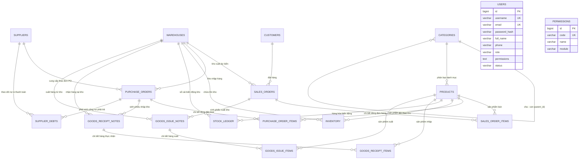

# SƠ ĐỒ THỰC THỂ QUAN HỆ (ERD) - HỆ THỐNG MINI-ERP THỜI TRANG & MAY MẶC

## 1. Sơ đồ Thực thể Quan hệ (Mermaid) - Kiến trúc Hợp nhất 18 Bảng (Zero-Join Core-FK)

---

## 2. Danh mục 18 Bảng Sau Khi Hợp Nhất & Tối Ưu Hóa

Hệ thống đã tinh gọn từ **27 bảng xuống còn 18 bảng (-9 bảng / -33%)**, loại bỏ các bảng phụ phân mảnh, giúp triệt tiêu các phép `JOIN` dư thừa và ngăn chặn lỗi N+1 Query:

| STT | Tên Bảng | Phân hệ | Mục đích & Chi tiết Hợp nhất |
|---|---|---|---|
| 1 | `users` | Auth/RBAC | **Hợp nhất (Zero-Join Auth)**: Gộp 4 bảng (`users`, `roles`, `user_roles`, `role_permissions`) thành 1 bảng duy nhất lưu trữ tài khoản, mật khẩu BCrypt, vai trò (`role`) và quyền hạn (`permissions`). |
| 2 | `permissions` | Auth/RBAC | Danh mục quyền chi tiết của hệ thống (Catalog tra cứu quyền). |
| 3 | `categories` | Phân hệ 1 (Bán hàng) | Cây phân cấp danh mục hàng may mặc tự tham chiếu (`parent_id`). |
| 4 | `products` | Phân hệ 1 (Bán hàng) | **Hợp nhất**: Tích hợp trực tiếp thuộc tính thời trang (`color`, `size`, `material`) và chính sách giá sỉ (`wholesale_price`). Bỏ bảng `product_attributes`, `price_lists`, `price_list_items`. |
| 5 | `customers` | Phân hệ 1 (Bán hàng) | **Hợp nhất**: Tích hợp trực tiếp nhóm khách hàng (`group_name`) và tỷ lệ chiết khấu mặc định (`discount_percent`). Bỏ bảng `customer_groups`. |
| 6 | `sales_orders` | Phân hệ 1 (Bán hàng) | **Hợp nhất**: Tích hợp nhật ký luân chuyển trạng thái vào cột `status_history JSON` cùng các trường audit (`cancelled_by`, `cancelled_at`, `status_note`). Bỏ bảng `sales_order_status_history`. |
| 7 | `sales_order_items` | Phân hệ 1 (Bán hàng) | Chi tiết dòng sản phẩm bán (Master-Detail, flat product info). |
| 8 | `suppliers` | Phân hệ 2 (Mua hàng) | **Hợp nhất**: Thông tin NCC, tiêu chí đánh giá (Chất lượng, Tiến độ, Đơn giá) và xếp hạng tín nhiệm A/B/C tích hợp 1 bảng duy nhất. Bỏ bảng `supplier_reviews`. |
| 9 | `purchase_orders` | Phân hệ 2 (Mua hàng) | Đơn đặt mua hàng NCC, quy trình duyệt hạn mức mua. |
| 10 | `purchase_order_items` | Phân hệ 2 (Mua hàng) | Dòng chi tiết sản phẩm và số lượng đặt mua theo PO. |
| 11 | `supplier_debts` | Phân hệ 2 (Mua hàng) | **Hợp nhất**: Theo dõi công nợ mua hàng và ghi nhận trực tiếp thông tin thanh toán (`payment_method`, `payment_reference`, `last_payment_date`, `paid_by`). Bỏ bảng `supplier_payments`. |
| 12 | `warehouses` | Phân hệ 3 (Kho hàng) | Danh mục kho hàng, chi nhánh thời trang, thông tin thủ kho. |
| 13 | `inventory` | Phân hệ 3 (Kho hàng) | Số dư tồn kho thời gian thực: Tồn thực tế (`on_hand`), Giữ chỗ (`reserved`), Khả dụng (`available`). |
| 14 | `stock_ledger` | Phân hệ 3 (Kho hàng) | Sổ cái kho (Stock Ledger) ghi nhận lịch sử biến động bất biến (Append-only). |
| 15 | `goods_receipt_notes` | Phân hệ 3 (Kho hàng) | Phiếu nhập kho thời trang (gắn với PO hoặc nhập kho khác). |
| 16 | `goods_receipt_items` | Phân hệ 3 (Kho hàng) | Chi tiết hàng thực nhận đối chiếu với đơn mua. |
| 17 | `goods_issue_notes` | Phân hệ 3 (Kho hàng) | Phiếu xuất kho thời trang (gắn với SO hoặc xuất khác). |
| 18 | `goods_issue_items` | Phân hệ 3 (Kho hàng) | Chi tiết sản phẩm thực xuất khỏi kho. |

---

## 3. Kiến trúc Cốt lõi: Zero-Join & Core-FK Constraints

1. **Toàn vẹn Dữ liệu Nghiệp vụ (Data Integrity via Core-FK)**:
   - Duy trì các khóa ngoại vật lý cốt lõi giữa Master - Detail (`sales_order_items` -> `sales_orders`, `purchase_order_items` -> `purchase_orders`, `goods_receipt_items` -> `goods_receipt_notes`, `goods_issue_items` -> `goods_issue_notes`) với `ON DELETE CASCADE`.
   - Khóa ngoại tham chiếu an toàn (`ON DELETE RESTRICT`) ngăn chặn việc xóa danh mục gốc khi đang có dữ liệu giao dịch: Khách hàng, Nhà cung cấp, Sản phẩm, Kho hàng.
2. **Truy vấn Đọc Phẳng Không JOIN (Zero-Join Flat Read Model)**:
   - Mỗi bảng giao dịch đều sao chép trực tiếp tên, mã hiển thị (Denormalization) như `customer_name`, `supplier_name`, `warehouse_name`, `product_sku`, `product_name`.
   - Các thuộc tính mở rộng (Màu sắc, Size, Giá buôn, Lịch sử duyệt đơn, Thanh toán công nợ) được nhúng trực tiếp vào bảng cha giúp màn hình danh sách và chi tiết tải ngay lập tức trong `1 câu lệnh SELECT đơn giản`.
